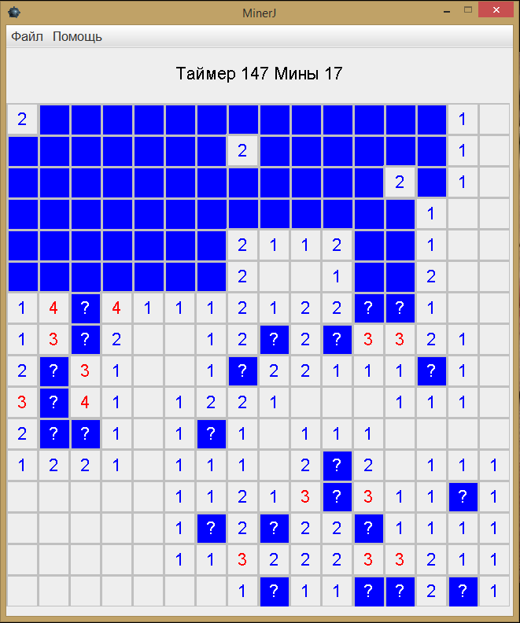

# Minerj
MinerJ is my first test exersice to Java developer position release on 18 Feb 2016

### Requirements

- Java 7

### How to run

**Linux:**
1. Open terminal
1. Move to project directory
1. Execute `java -jar artifacts/MinerJ.jar`

**Windows:**
1. Open file explorer
1. Move to project directory and then to `artifacts` one
1. Execute `MinerJ.exe` file

### Screenhot

